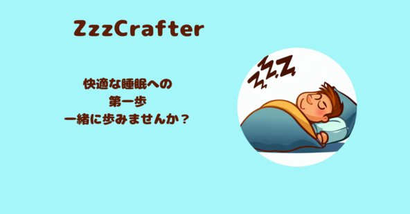

# ZzzCrafter

## サービス概要
ZzzCraferは、睡眠に役立つルーティーンを選んで実践していただき、睡眠の質を向上させていくことを目的としたアプリです。 
どのルーティーンを実行したら朝の調子が良くなるかを可視化し、自分に合ったルーティーンを探すことができます。

## サービスのURL
https://zzzcrafter.com

## 主な機能
- ルーティーン登録機能
- 過去に登録したルーティーンの確認機能
- 起床時間、就寝時間の登録機能
- 過去の起床時間、朝の調子の確認機能
- レコメンドルーティーンの提案機能
- LINE Push通知機能

## 使用技術

| カテゴリ         | 技術               |
|----------------|-------------------|
| バックエンド     | Ruby on Rails 7.0.6 |
|              | Ruby 3.0.2        |
| フロントエンド   | Hotwire       |
|              | TailwindCSS    |
| データベース    | PostgreSQL        |
| インフラ        | Fly.io            |
| API            | LINE Messaging API|

### ER図

