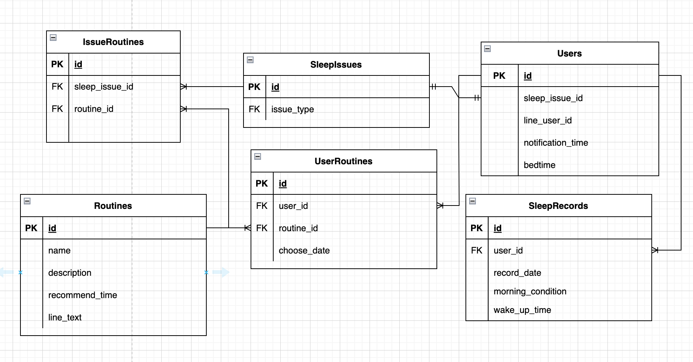

# ZzzCrafter

## サービス概要
ZzzCraferは睡眠に役立つルーティーンを選んで実践していただき、睡眠の質を向上させることを目的としたアプリです。 
どのルーティーンを実践したら朝の調子が良くなるかを可視化し、自分に合ったルーティーンを探すことができます。

## サービスのURL
https://zzzcrafter.fly.dev

## 主な機能

| 睡眠の記録の確認 | ルーティーンの登録 | おすすめのルーティーンの確認 |
|:-------------------:|:-----------------------------:|:-----------------:|
|  |  |  |
| 睡眠の記録を確認できます。 起床、就寝時間の設定も行えます。 | ルーティーン一覧を確認し、 登録することができます。 | 今まで実践したルーティーンの中から、最適なものを確認できます。 |

## 使用技術

| カテゴリ         | 技術               |
|----------------|-------------------|
| バックエンド     | Ruby on Rails 7.0.6 |
|              | Ruby 3.0.2        |
| フロントエンド   | Hotwire       |
|              | TailwindCSS    |
| データベース    | PostgreSQL        |
| インフラ        | Fly.io            |
| API            | LINE Messaging API|

### ER図

